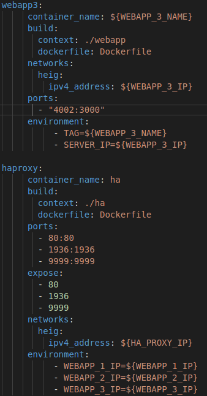
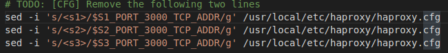
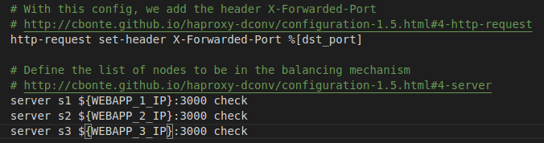
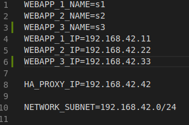

title: Lab 04 - Docker
---

## Lab 03 - Docker

#### Table of content

#### Introduction

#### Chapter 0
[M1]Do you think we can use the current solution for a production environment? What are the main problems when deploying it in a production environment?
``` 
This is not a good idea to use our previous solution in production because it alwayshave 2 servers and never more or less.
When a lot of client are going to connect, ourserver could be under too many trafics and could not handle new requests so the newclient won't have any answer.
In the other case when there is no user, we still have twonode up which are beeing used for nothing and cost money for nothing.
```
[M2] Describe what you need to do to add new webapp container to the infrastructure. Give the exact steps of what you have to do without modifiying the way the things are done. Hint: You probably have to modify some configuration and script files in a Docker image.

```
To add a new image we have some file to change, thoses are the files and the modifications we have done :
1) Modification of "docker-compose.yml" so we can add a node name webapp3 which use envvar from haproxy.
```


```
2) Modification of /ha/scripts/run.sh so it know which node to use.
```


```
3) Modification of /ha/config/haproxy.cfg.
```


```
4) We need to change the .env file to add the servers3 env variables.
```


[M3] Based on your previous answers, you have detected some issues in the current solution. Now propose a better approach at a high level.

[M4] You probably noticed that the list of web application nodes is hardcoded in the load balancer configuration. How can we manage the web app nodes in a more dynamic fashion?

[M5] In the physical or virtual machines of a typical infrastructure we tend to have not only one main process (like the web server or the load balancer) running, but a few additional processes on the side to perform management tasks.

[M6] What happens if we add more web server nodes? Do you think it is really dynamic? It's far away from being a dynamic configuration. Can you propose a solution to solve this?
#### Chapter 1

#### Chapter 2

#### Chapter 3

#### Chapter 4

#### Chapter 5

#### Chapter 6


#### Difficulties


#### Conclusion.