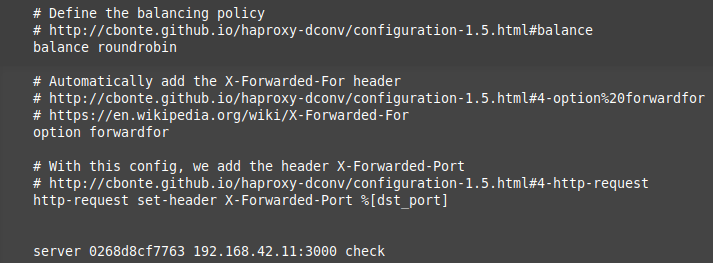

title: Lab 04 - Docker
---

## Lab 04 - Docker

#### Table of content

#### Introduction

#### Task 0
[M1]Do you think we can use the current solution for a production environment? What are the main problems when deploying it in a production environment?
``` 
This is not a good idea to use our previous solution in production because it always have 2 servers and never more or less.
When a lot of client are going to connect, our server could be under too many trafic and could not handle new requests so the new client won't have any answers.
In the other case when there is no user, we still have two nodes up which are beeing used for nothing and cost money for nothing.
```
[M2] Describe what you need to do to add new webapp container to the infrastructure. Give the exact steps of what you have to do without modifiying the way the things are done. Hint: You probably have to modify some configuration and script files in a Docker image.

```
To add a new image we have some file to change, thoses are the files and the modifications we have done :
1) Modification of "docker-compose.yml" so we can add a node name webapp3 which use envvar from haproxy.
```


```
2) Modification of /ha/scripts/run.sh so it know which node to use.
```


```
3) Modification of /ha/config/haproxy.cfg.
```


```
4) We need to change the .env file to add the server 3 env variables.
```


[M3] Based on your previous answers, you have detected some issues in the current solution. Now propose a better approach at a high level.
```
There is too much files to modify, the procedure is too heavy. And we also need to restart all the infrastructure.

It should be a good idea to make thing smoother, for example the load balancer should automatically add new nodes discovered in the network.
```

[M4] You probably noticed that the list of web application nodes is hardcoded in the load balancer configuration. How can we manage the web app nodes in a more dynamic fashion?
```
We can make a system where each new node query the load balancer to tell that he is available to handle load, and then the load balancer adds them.
```

[M5] Do you think our current solution is able to run additional management processes beside the main web server / load balancer process in a container? If no, what is missing / required to reach the goal? If yes, how to proceed to run for example a log forwarding process?
```
Yes, we can find a workaround, we can edit the 'run.sh' script and add instruction to log the node activities.
But this not an optimal solution.
```

[M6] What happens if we add more web server nodes? Do you think it is really dynamic? It's far away from being a dynamic configuration. Can you propose a solution to solve this?
(Répondre à la deuxième partie)
```
It's not dynamic since we have to restart the load balancer.
```

Deliverables:

1)


2)
https://github.com/VictorTruan/Teaching-HEIGVD-AIT-2019-Labo-Docker

#### Task 1

1) 


2)
We didn't encounter any difficulties as the explanation in the alb instructions were good.

We are installing a process supervisor, because the Docker philosophy is to run only one process per container, however this is not always what we want to do, so we can use a workaround called S6.


S6 permit us to run more than one process at a time and even more features. In order to do this we must set the entrypoint of the Docker Image as the S6 process.

#### Task 2

1)

```
As we can see in the screen, the cluster was correctly joined.
```


```
The ping between the peers was working.
```


```
Because of the fact the it's working, all the modifications that we sould do to make thoses works won't be apply. The network are handle in the docker-compose file-
All the asked logs are in the folder following the instructions.

We should not be able to connect right now because they can not find the proxy and we would use --network to help with that.
```
2) A VERIFIER
```
In our current solution, if we need to reload the load balancer the whole cluster could be deleted which can be an issue because later we want to reconnect to it and it won't be availible anymore and no gossip would be possible.
```
3)
```
source : https://en.wikipedia.org/wiki/Gossip_protocol

https://www.serf.io/docs/internals/gossip.html

Serf is using the GOSSIP protocol which is a protocol based on how an epidemic spead, it's very usefull when there is no central registry and we want to be sure that everybody have the information.
It's working in the following way: When somebody got an information, it tells one person about it when there is a "meeting". At the next meeting two peoples will have thie information so both of them will tell 2 peers. The information is now availible for 4 peers and so on.
In serf, new node must know at least one IP of an existing member in the cluster to begin the gossip.
```

#### Task 3

1)
```
All three log files are in the folder /logs/Task3
The HAProxy logs are in the file ha.log
The first backend logs are in the file s1.log
The second backend logs are in the file s2.log
```

2)

```
This screenshot was taken in the ha docker.
The logs are in the file /logs/Task3/ha_deli2.log
```

#### Task 4
1) A VERIFIER
```
Not the whole image was rebuilt, the first layer were able to be reused as nothing change before them. But when a layer change we can see that the building process can not use the old layer he has in cache and must rebuilt them.
We can see that Step2 use a cahce and Step3 can not.
```


```
When we use multiple layers with multiple RUN instruction, we create a new layer for each command which can be usefull when we want to add instructions because only the nexts layers are going to be rebuild. It's going to rebuilt faster.

When we use a single one with multiple agument, it save us from having too much layer but when we need to add or remove commands from this layer we must recreate the whole layer which can be long to do.


```
2)
```
Our dockerfiles have similarities but thoses are not in the first layers. For example we could change the position of the EXPOSE instruction to be in order with the other identicals instructions. The more identical instructions we can but at the beggining the most layer we won't rebuild.
```
3)
```
In this part to launch the image we use docker-compose up --build haproxy
and with webapp1 and webapp2 so the docker would not all be run a the same time.
First file : /logs/Task4/haproxy1.cfg
```

```
Second file : /logs/Task4/haproxy2.cfg
```

```
Third file : /logs/Task4/haproxy3.cfg
```


The others files named inspectha.log, inspects1.log, inspects2.log and dockerps.log are in the folder /log/Task4


4)
```
We are not appending data to it, we can not have an history about what happend which can be usefull in a log file.
```

#### Task 5
1)
```
First file : /logs/Task5/haproxy1.cfg
```

```
Second file : /logs/Task5/haproxy2.cfg
```

```
Third file : /logs/Task5/haproxy3.cfg
```


```
The others files named inspectha.log, inspects1.log, inspects2.log, dockerps.log are in the folder /log/Task5
```
2)
```
Nodes before one down:
```


3)
```
Nodes after one down:
```

```
Config file after one down:
This file is located in /logs/Task5/haproxy_down.log
```


4)

#### Chapter 6

1)

```
We can see that 4 nodes are used.
The log file is in /logs/Task6 and is named dockerps.log
```
2)
```
We find the solution really impressive, we have an efficient way to add or remove nodes from the load balancer simply by running or stopping them.
```

#### Difficulties


#### Conclusion.
